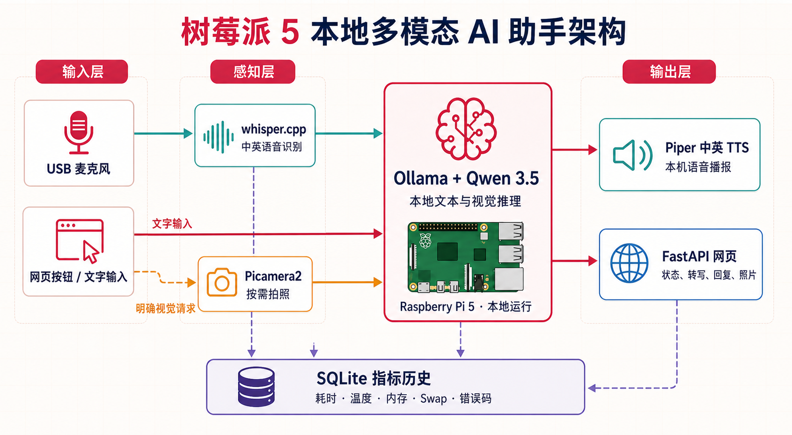

# 重拾树莓派 5 多模态 AI：从 Ollama、Whisper 到本地中英语音与视觉助手

两篇旧教程之后，我重新把树莓派 5 上的 LLM、摄像头和语音模块整理成了一个可以长期运行的本地桌面助手。

这一次不再是“每个模块单独跑通就算完成”，而是把它们真正连成一条完整链路：

```text
按键录音 → 中英语音识别 → 按需拍照 → 多模态推理 → 中英语音播报 → 网页展示
```

最终效果包括：

- 可以在局域网页面按键录音，也可以直接输入文字。
- 支持中文、英文和中英混合语音识别。
- 勾选网页开关，或说出明确的视觉口令时自动拍照。
- 使用 Qwen 3.5 同时处理文字和图片。
- 使用 Piper 分别合成中英文，中英混合回复也能顺序播报。
- 网页实时显示状态、转写、回答、照片、耗时、温度、内存和 swap。
- 原始录音和照片处理后删除，不把真实会话媒体长期留在卡里。

完整代码和逐条复刻 README：

**GitHub：<https://github.com/83900/raspberry-pi5-multimodal-assistant>**

---

## ⚠️ ATTENTION

本次实践配置：

- Raspberry Pi 5 8GB
- 64GB microSD
- 64 位 Raspberry Pi OS
- USB 免驱麦克风
- 树莓派官方广角摄像头
- 主动散热模块
- Ollama `0.32.15`
- 日常模型 `qwen3.5:2b`
- Whisper.cpp + Q5_0 多语言模型
- Piper 中英文 voice

实机验证时间为 **2026-08-25**。软件、模型标签和下载方式以后可能变化，请以仓库 README 和官方文档为准。

📌 本项目不会随意升级系统：安装脚本只执行一次软件源索引刷新，并安装明确需要的软件包，**不执行 `apt upgrade`，也不做发行版升级**。

---

## 一、为什么要重新做一遍？

旧方案是 Whisper 负责听、LLaVA 负责看，再用 Python 把两个命令拼起来。它能证明“树莓派可以跑”，但还有几个明显问题：

1. 模型标签容易变化，`latest` 可能在不知情时换成更大版本。
2. 旧摄像头命令和 whisper.cpp 构建方式已经变化。
3. 使用 `pip --break-system-packages` 会污染系统 Python。
4. 8GB swap 被当成运行 LLM 的默认条件，实际容易伤 microSD，也掩盖了上下文和并发配置问题。
5. 模型收到一句“take a photo”并不会凭空获得摄像头，它必须先由程序拍照，再把图片放进请求。
6. CLI 适合单模块测试，但缺少状态、失败回退、并发控制和长期服务管理。

所以这次的目标不是简单“换一个模型”，而是重新整理工程边界。

---

## 二、整体架构



状态机固定为：

```text
IDLE
  → RECORDING
  → TRANSCRIBING
  → CAPTURING（需要图片时）
  → THINKING
  → SPEAKING
  → IDLE / ERROR
```

同一时间只允许一个交互任务。如果上一轮还在推理，新请求会明确返回 `409 busy`，不会一直堆在内存里。

---

## 三、模型为什么选择 Qwen 3.5 2B？

Ollama 模型库中的 `qwen3.5:2b` 约 2.7GB，`qwen3.5:4b` 约 3.4GB，两者都支持文本和图片输入。

本项目的默认策略是：

- `qwen3.5:2b` 日常使用。
- `qwen3.5:4b` 只做固定测试集对照。
- 上下文主动限制为 4096。
- 单并发、最多只加载一个模型。
- 关闭思考模式。
- 最多生成约 192 token，并用系统提示要求简短回答。

模型“支持 256K 上下文”不代表树莓派应该真的开到 256K。边缘设备上最先要控制的是内存、延迟和温度，而不是追求纸面参数。

官方模型列表：<https://ollama.com/library/qwen3.5/tags>

---

## 四、先审计旧环境，不要直接覆盖

如果和我一样，树莓派里已经留下旧 Ollama、Whisper、LLaVA、Python 脚本和 8GB swap，不建议直接重刷或删除。

克隆代码：

```bash
cd ~
git clone https://github.com/83900/raspberry-pi5-multimodal-assistant.git pi-edge-assistant
cd ~/pi-edge-assistant
```

先运行：

```bash
./scripts/audit_pi.sh
./scripts/backup_old_environment.sh
```

审计会记录：

- 系统、内核、架构、树莓派型号和 CPU。
- 内存、磁盘、swap 设备和实际挂载位置。
- USB、麦克风、扬声器和摄像头。
- Ollama 版本、模型清单和 systemd 服务。
- Whisper 可执行文件。
- 温度、降频标志和网络监听端口。

备份只保存脚本、配置、systemd 文件和模型清单，不重复备份几 GB 的模型。

### 关于旧 8GB swap

旧教程里用 `df -h` 验证 swap，这是不准确的。应该使用：

```bash
free -h
swapon --show
findmnt --target /mnt/swapfile
```

如果 `/mnt` 没有单独挂载 NVMe 或 USB 磁盘，那么 `/mnt/swapfile` 仍然在 microSD 根分区。

这次先保留旧 swap 观察，但目标是 2B 正常运行时不依赖它。确认长期稳定后，再考虑小型应急 swap 或 zram。

---

## 五、安装应用：只装必要内容

```bash
cd ~/pi-edge-assistant
./scripts/install_pi.sh
```

安装脚本只安装：

```text
python3-venv python3-dev build-essential cmake git curl
ffmpeg alsa-utils rpicam-apps python3-picamera2
```

随后建立 `.venv` 并安装应用依赖。

📌 **重点：**不再使用 `pip --break-system-packages`。Picamera2 继续使用 Raspberry Pi OS 提供的系统包，应用本身运行在虚拟环境中。

安装结束后，用户级 systemd 服务已经写好，但不会立即启动。这样可以先把模型、麦克风和 voice 全部检查完成。

---

## 六、安装 Ollama 和模型

### 树莓派网络正常

```bash
curl -fsSL https://ollama.com/install.sh | sh
./scripts/install_ollama_limits.sh
./scripts/setup_models.sh
```

需要 4B 对照时：

```bash
./scripts/setup_models.sh --compare
```

### 树莓派下载不稳定：Mac 中转

这次我专门保留了 Mac 弱网中转方案，而且 **Mac 不需要预装 Ollama**。

下载 Ollama ARM64 包：

```bash
cd ~/Downloads
curl -L https://ollama.com/download/ollama-linux-arm64.tgz \
  -o ollama-linux-arm64.tgz
scp ollama-linux-arm64.tgz 用户名@树莓派IP:~/pi-edge-assistant/
```

树莓派安装：

```bash
cd ~/pi-edge-assistant
./scripts/install_ollama_arm64_archive.sh ./ollama-linux-arm64.tgz
./scripts/install_ollama_limits.sh
```

模型也能在 Mac 用仓库脚本下载：

```bash
python3 scripts/download_ollama_model.py qwen3.5:2b qwen3.5-2b
```

脚本支持断点续传和 SHA-256 校验。传输到树莓派：

```bash
rsync -avP qwen3.5-2b/ 用户名@树莓派IP:~/qwen3.5-2b/
```

树莓派导入：

```bash
./scripts/install_ollama_model_bundle.sh ~/qwen3.5-2b
ollama list
```

模型文件太大，不会提交到 GitHub；仓库保存的是可复刻的下载和安装代码。

---

## 七、更新 whisper.cpp

```bash
./scripts/setup_whisper.sh
```

新版 whisper.cpp 使用 CMake，执行文件在：

```text
~/whisper.cpp/build/bin/whisper-cli
```

脚本会下载多语言 base 和 small，并生成 Q5_0 量化版本。

本项目不会凭感觉选 small。正确做法是准备至少 24 条近场录音：

- 中文 8 条
- 英文 8 条
- 中英混合 8 条

分别统计中文 CER、英文 WER、混合指令关键内容正确率和实时系数 RTF。

选择规则：small 相对 base 至少改善 10%，并且 RTF 不超过 1.0，才切换；否则继续用 base。

whisper.cpp：<https://github.com/ggml-org/whisper.cpp>

---

## 八、安装 Piper 中英文语音

```bash
./scripts/setup_tts.sh
```

默认下载：

- 中文 `zh_CN-huayan-medium`
- 英文 `en_US-lessac-medium`

每个 voice 都要有 `.onnx` 和 `.onnx.json` 两个文件。应用会把加载后的 voice 保持在内存中，避免每句话重新加载。

对于“这是 Raspberry Pi, running locally”这种中英混合回答，程序会按字符片段拆成中文和英文，分别合成后顺序播放。

Piper voice 列表：<https://github.com/OHF-Voice/piper1-gpl/blob/main/docs/VOICES.md>

---

## 九、重新测试摄像头和麦克风

Bookworm 起摄像头命令改为 `rpicam-*`：

```bash
rpicam-hello --list-cameras
rpicam-still --nopreview --immediate -o /tmp/test.jpg
```

麦克风：

```bash
arecord -l
arecord -L
```

完整硬件冒烟测试：

```bash
./scripts/smoke_test_hardware.sh
```

它会拍一张照片、录制 5 秒 16kHz 单声道音频，再从默认输出播放。

如果默认麦克风不正确：

```bash
AUDIO_CAPTURE_DEVICE=plughw:2,0 ./scripts/smoke_test_hardware.sh
```

设备编号可能在重启后变化，长期使用时优先选择 `arecord -L` 中的稳定设备名。

官方摄像头文档：<https://www.raspberrypi.com/documentation/computers/camera_software.html>

---

## 十、为什么一句“take a photo”以前会失败？

当用户只把这句话发给纯文本模型：

```text
take a photo and describe it in Chinese
```

模型没有收到图片，自然只能回答“我没有摄像头功能”。

正确的程序流程应该是：

```text
识别明确视觉口令
    → 程序调用 Picamera2
    → 拍摄并压缩 JPEG
    → 图片和文字一起发送给 Qwen
    → Qwen 根据画面回答
```

当前版本支持的典型口令包括：

```text
看看、看一下、拍照、拍张、画面、照片、摄像头、眼前
what do you see、look at、camera、photo、snapshot、image、picture
```

网页上的“附带当前画面”开关优先级更高。这样行为可预测，也能避免普通聊天误拍。

照片默认压缩到 640×480。实测同一台树莓派上，1024×768 的视觉推理约 59.7 秒，改成 640×480 后热态约 24.4 秒，所以 640×480 更适合作为日常默认值。

---

## 十一、启动网页助手

先检查：

```bash
nano ~/.config/pi-edge-assistant/edge-assistant.env
```

通常只需要确认音频设备、Whisper 模型和 Piper voice 路径。

启动：

```bash
systemctl --user start pi-edge-assistant
systemctl --user status pi-edge-assistant --no-pager
```

查看日志：

```bash
journalctl --user -u pi-edge-assistant -f
```

读取随机访问口令和 IP：

```bash
cat ~/.local/share/pi-edge-assistant/access-token
hostname -I
```

同一局域网打开：

```text
http://树莓派IP:8080
```

网页包括：

- 开始/停止录音
- 文本输入
- 附带当前画面
- 使用 4B 对照
- 停止播报
- 清空历史
- 状态、转写、回复、最近照片
- ASR、拍照、LLM、TTS 和总耗时
- CPU 温度、内存、swap、模型和错误原因

⚠️ Ollama 只监听 `127.0.0.1:11434`。网页监听局域网地址，但需要随机口令。不要把 8080 或 11434 映射到公网。

---

## 十二、实机测试结果

当前 2B 结果如下：

| 测试 | 结果 |
|---|---|
| 纯文本冷启动 | 约 21.3 秒，模型加载约 7.7 秒 |
| 纯文本热态短回复 | 约 5.5 秒 |
| 1024×768 视觉热态 | 约 59.7 秒 |
| 640×480 视觉热态 | 约 24.4 秒 |
| 英文口令自动拍照并中文回复 | 成功 |
| 冷模型完整视觉请求 | LLM 约 42 秒，TTS 约 6.1 秒 |
| 峰值内存 | 约 4.5–4.6GB |
| swap | 0 |
| 最高温度 | 约 58.4°C |
| 降频 | 未发生 |

第一次请求需要加载模型，所以冷启动和热态必须分开记录。

2B 已经能完成本地文字、视觉和双语语音链路；4B 是否值得常用，还需要相同测试集对照正确率和延迟，不能只看参数大小。

---

## 十三、温度控制：不要等到 70°C 才开始转

接入主动散热后，我把风扇策略调整为：

- 45°C：低速启动
- 55°C：提高转速
- 65°C：高速
- 70°C：接近满速

编辑：

```bash
sudo nano /boot/firmware/config.txt
```

在 `[all]` 下加入：

```ini
dtparam=fan_temp0=45000
dtparam=fan_temp0_hyst=5000
dtparam=fan_temp0_speed=75
dtparam=fan_temp1=55000
dtparam=fan_temp1_hyst=5000
dtparam=fan_temp1_speed=125
dtparam=fan_temp2=65000
dtparam=fan_temp2_hyst=5000
dtparam=fan_temp2_speed=175
dtparam=fan_temp3=70000
dtparam=fan_temp3_hyst=5000
dtparam=fan_temp3_speed=250
```

重启后检查：

```bash
vcgencmd measure_temp
vcgencmd get_throttled
cat /sys/class/thermal/cooling_device0/cur_state
```

相比一直满转，这种曲线噪音更低；相比 70°C 才启动，又能更早压住持续推理温度。第三方控制板如果有自己的风扇守护程序，应使用对应工具，不要重复配置。

---

## 十四、故障怎么降级？

桌面助手不能因为一个模块失败就彻底卡死，所以这次专门做了回退：

- 摄像头失败：显示警告，继续纯文本问答。
- Piper 失败：网页保留文字回复。
- 扬声器失败：网页提供临时音频播放。
- Ollama 超时或 OOM：卸载当前模型，释放任务锁并提示回到 2B。
- 并发请求：返回 `409 busy`。
- 成功或失败：原始录音和照片都删除。

常用排查：

```bash
journalctl --user -u pi-edge-assistant -n 100 --no-pager
sudo journalctl -u ollama -n 100 --no-pager
free -h
swapon --show
vcgencmd measure_temp
vcgencmd get_throttled
```

---

## 十五、下一步如何验收？

仓库已经包含 ASR、模型和 30 轮稳定性测试工具。

```bash
.venv/bin/python benchmarks/benchmark_asr.py benchmarks/asr_manifest.jsonl
.venv/bin/python benchmarks/benchmark_ollama.py benchmarks/multimodal_manifest.jsonl
.venv/bin/python benchmarks/soak_test.py --rounds 30
```

目标：

- ASR RTF 不超过 1.0。
- 文本请求停止录音到开始播报中位数不超过 15 秒。
- 带图请求中位数不超过 30 秒。
- 30 轮成功率至少 95%，无 OOM 和服务崩溃。
- 峰值内存不超过约 6.5GB。
- 没有持续 swap 抖动。
- 满载温度低于 80°C，无当前降频。

如果剩余空间低于 15GB 或模型载入明显卡在 microSD I/O，优先升级 NVMe，而不是扩大 swap。只有以后做摄像头常开检测、分割或姿态估计，才考虑 AI HAT+；它不能直接替 Ollama 加速 LLM。

---

## 总结

这次改造最重要的不是“树莓派又跑了一个新模型”，而是把几个容易失控的环节固定下来：

- 固定模型标签和上下文。
- 单模型、单并发。
- 先拍照，再把图片交给多模态模型。
- 摄像头、语音和播放都可以独立失败并回退。
- 用数据决定 base/small、2B/4B，而不是凭感觉换大模型。
- 不依赖重度 microSD swap。
- 不污染系统 Python，不顺手升级整套系统。
- 所有代码、配置、安装和测试步骤放进同一个公开仓库。

如果你也有一台 Raspberry Pi 5 8GB，这套方案已经可以作为一个可复刻的本地多模态 AI 起点。

完整代码与部署 README：

**<https://github.com/83900/raspberry-pi5-multimodal-assistant>**

P.s. 旧教程中的 `df -h` 验证 swap、`libcamera-*`、whisper.cpp 的 `make/main`、默认 `pi/raspberry` 和 `pip --break-system-packages` 等写法，均已在本次仓库中更新。
