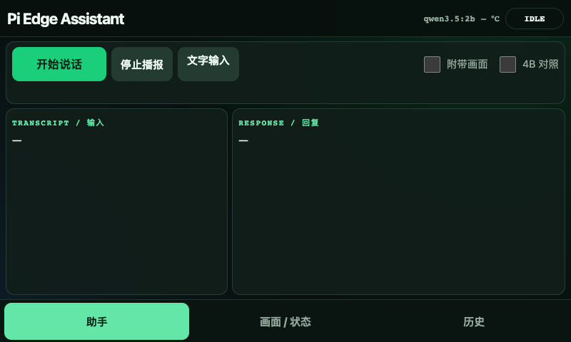
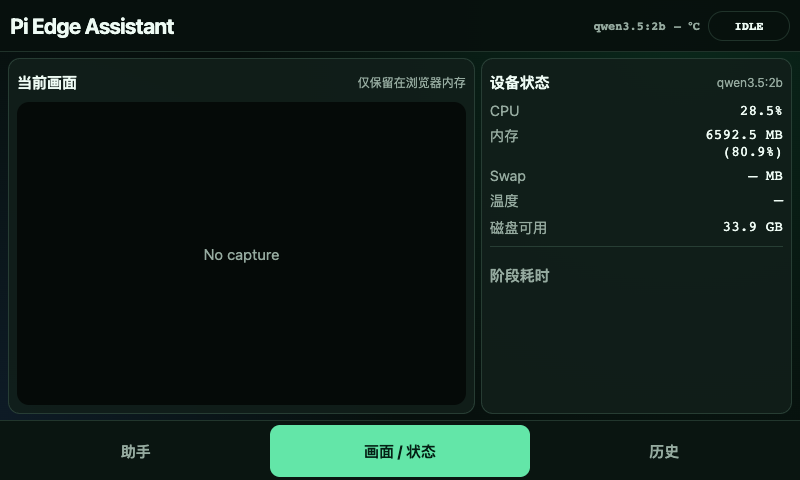
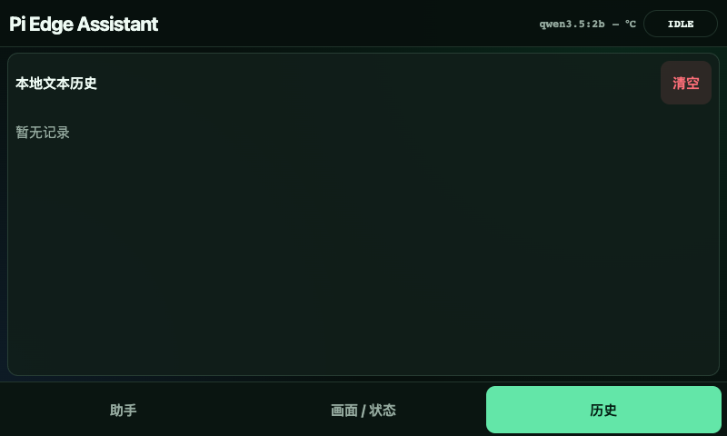

# 给树莓派 AI 助手装上一块屏幕，再教它判断什么时候该拍照

上一篇完成了树莓派 5 上的本地多模态链路：

```text
按键录音 → Whisper 识别 → 按需拍照 → Qwen 推理 → Piper 播报 → 网页展示
```

网页在电脑和手机上很好用，但树莓派旁边已经接了一块 4.3 英寸触摸屏，每次还要掏出手机显然不够像一个完整产品。

另外，旧版本只能识别“拍照、看看摄像头、what do you see”这类明确关键词。用户如果问：

```text
我手里拿的是什么？
门关好了吗？
What color is my shirt?
```

这些句子没有直接出现“拍照”或“camera”，程序就不会把画面交给模型。

所以这次做两件事：

1. 把现有网页助手改造成树莓派 800×480 触摸屏上的桌面软件。
2. 用 multilingual-E5 加一个很小的分类头，让程序自己判断问题是否依赖当前画面。

最终流程变成：

```text
点击桌面图标
    → 全屏触摸界面
    → 录音或文字输入
    → 明确规则 / E5 视觉意图分类
    → 按需拍照
    → Qwen 多模态回答
    → Piper 播报
    → 退出并返回桌面
```

完整代码和逐条复刻 README：

**GitHub：<https://github.com/83900/raspberry-pi5-multimodal-assistant>**

---

## ⚠️ ATTENTION

本次实践配置：

- Raspberry Pi 5 8GB
- 64GB microSD
- 64 位 Raspberry Pi OS Bookworm
- 微雪 4.3inch DSI 触摸屏
- 横向 800×480、60Hz
- FT5x06 电容触控
- USB 麦克风
- 树莓派官方广角摄像头
- Chromium + labwc/Wayland
- FastAPI 本地助手 0.4.0
- `intfloat/multilingual-e5-small`
- ONNX Runtime CPU
- Qwen 3.5 2B

实机验证时间为 **2026-09-02**。模型、Python wheel 和系统桌面环境以后可能变化，请优先参考仓库 README 与官方资料。

微雪官方资料显示，常见 4.3inch DSI LCD 的硬件分辨率为 800×480，支持 5 点电容触控，Pi 5 使用 22Pin DSI1 接口，在 Raspberry Pi OS 下无需额外触控驱动：

<https://www.waveshare.com/wiki/4.3inch_DSI_LCD>

📌 本次没有修改已经正常工作的 DSI overlay、旋转和触控配置，也没有执行 `apt upgrade`。

---

## 一、为什么继续使用网页，而不是重写 Qt/GTK？

现有助手已经有一套 FastAPI 接口和网页，能够显示：

- 开始和停止录音
- 转写文字与模型回复
- 最后一张照片
- 温度、内存、swap 和磁盘
- ASR、拍照、LLM、TTS 各阶段耗时
- 历史记录和错误原因

如果为了触摸屏重新写 Qt 或 GTK，相当于还要维护第二套界面、第二套状态同步和第二套音频逻辑。

所以我选择：

```text
现有 FastAPI + Chromium kiosk + 800×480 专用 CSS
```

它看起来是一个全屏桌面软件，底层仍然复用原来的网页和 API。电脑、手机继续访问普通网页；树莓派本机只是在 Chromium 中打开：

```text
http://127.0.0.1:8080/?display=1
```

`display=1` 只切换布局和本机授权方式，不创建第二套后端。



📌 上图是按 800×480 视口完成的浏览器验收截图，不是把桌面版页面等比例缩小。

---

## 二、先确认屏幕和触控真的被系统识别

### 1. 查看显示接口

```bash
for status in /sys/class/drm/card*-*/status; do
  echo "$status: $(cat "$status")"
done
```

实机正常结果：

```text
/sys/class/drm/card1-DSI-2/status: connected
```

查看模式：

```bash
cat /sys/class/drm/card1-DSI-2/modes
```

输出：

```text
800x480
```

Wayland/labwc 桌面还可以运行：

```bash
XDG_RUNTIME_DIR=/run/user/$(id -u) \
WAYLAND_DISPLAY=wayland-0 \
wlr-randr
```

本次实测为：

```text
DSI-2
800x480 px, 60.029 Hz (preferred, current)
Scale: 1.000000
```

### 2. 查看触控设备

```bash
grep -i -B2 -A5 -E 'touch|ft5|goodix' /proc/bus/input/devices
```

实机识别为：

```text
11-0038 generic ft5x06
ID_INPUT_TOUCHSCREEN=1
```

⚠️ **踩坑记录：**第一次测试时屏幕没有连接，`wlr-randr` 只显示 `NOOP-1 1920x1080`，内核中也没有 DSI 和触控设备。这不是 CSS 或 Chromium 的问题，而是系统当时只有无头虚拟输出。看到 `NOOP-1` 时应先检查排线和供电，不要立刻改系统配置。

---

## 三、为 800×480 重新整理界面

4.3 英寸屏幕不能简单把电脑网页缩小，否则按钮难点、内容溢出，虚拟键盘还会挡住回答。

触摸模式改成底部三个固定页签：

### 助手

- 大尺寸“开始说话 / 停止并识别”按钮
- 附带画面
- 2B / 4B 对照
- 停止播报
- 浏览器播放
- 折叠文字输入
- 转写和可滚动回复

### 画面 / 状态

- 最后一张照片
- 当前模型
- CPU、内存、swap、磁盘和温度
- 可展开的阶段耗时
- E5 视觉意图概率和阈值

### 历史

- 最近 30 条记录
- 输入、回复、模型和错误码
- 二次确认后清空

所有主要触控区域不小于 48×48px，底部页签高度约 56px，同时关闭横向溢出、双指缩放和浏览器历史返回手势。

网页还会申请 Screen Wake Lock。X11 环境额外执行：

```bash
xset s off
xset -dpms
```

这样助手打开时不会因为系统空闲自动黑屏。





---

## 四、本机自动授权，但不能把局域网口令写进页面

普通局域网页面仍然需要随机访问口令，但树莓派屏幕每次启动都输入一遍密码没有意义。

后端新增：

```text
POST /api/display/session
```

它只接受真实来源为：

```text
127.0.0.1
::1
```

接口返回应用启动时生成的临时 display token。前端只把 token 放在 JavaScript 内存中，不写进 URL，也不放进 `localStorage`。

REST 和 WebSocket 都执行两层检查：

1. token 必须匹配临时 display token；
2. 当前请求本身也必须来自回环地址。

因此即使其他设备意外拿到 display token，也不能从局域网使用。实机测试结果：

```text
回环地址申请 display session：200
局域网地址申请 display session：403
局域网使用 display token：401 / WebSocket 1008
```

📌 不信任 `X-Forwarded-For`，判断依据是实际 socket 客户端地址，避免伪造请求头绕过。

---

## 五、把网页做成可以打开和退出的桌面软件

第一版是开机自动进入 kiosk，但实际使用后我更希望：

```text
开机进入普通桌面
    → 需要时点击图标
    → 打开全屏助手
    → 使用完成后退出
    → 返回桌面
```

安装：

```bash
cd ~/pi-edge-assistant
./scripts/install_kiosk.sh
```

脚本会：

- 检查分辨率和触控设备，但不改 DSI 设置；
- 复用已经安装的 Chromium；
- 仅在 Chromium 完全不存在时安装浏览器，不升级系统；
- 创建 `~/Desktop/Pi Edge Assistant.desktop`；
- 同时写入 `~/.local/share/applications/`，让它出现在应用菜单；
- 使用独立 Chromium profile；
- 使用 `flock` 防止重复打开多个窗口；
- 删除旧的 kiosk 自动启动入口。

桌面文件的核心内容：

```ini
[Desktop Entry]
Type=Application
Name=Pi Edge Assistant
Name[zh_CN]=树莓派本地助手
Exec=/home/pi/pi-edge-assistant/scripts/start_kiosk.sh
Terminal=false
StartupNotify=false
```

### 退出为什么不能只写 `window.close()`？

浏览器通常不允许普通网页随意关闭不是由脚本创建的窗口。因此这里没有依赖 `window.close()`，而是新增本机接口：

```text
POST /api/display/exit
```

接口只接受回环来源的 display token。后端在运行目录写入一次性 `kiosk.exit` 标记，启动包装器检测到后关闭拥有专用 profile 的 Chromium 进程。

如果当前状态是：

```text
RECORDING / TRANSCRIBING / CAPTURING / THINKING / SPEAKING
```

未确认退出会返回：

```text
409 interaction is still running
```

前端弹出二次确认，用户确认后才关闭窗口。退出只关闭屏幕界面，正在执行的任务、FastAPI、Ollama 和局域网页面继续运行。

实机验证：

```text
空闲退出：204，Chromium 进程归零
录音中未确认退出：409，窗口保留
录音中确认退出：204，窗口关闭
后台录音任务继续完成，最终回到 IDLE
```

SSH 运维：

```bash
./scripts/kiosk_control.sh status
./scripts/kiosk_control.sh pause
./scripts/kiosk_control.sh resume
./scripts/kiosk_control.sh restart
./scripts/kiosk_control.sh logs
```

---

## 六、关键词为什么不够？

旧规则类似：

```python
VISION_TRIGGERS = (
    "看看", "看一下", "拍照", "画面", "摄像头",
    "what do you see", "look at", "camera", "photo",
)
```

优点是速度快、结果可预测；缺点是表达稍微自然一点就漏掉：

```text
我手里拿的是什么？
杯子在电脑左边还是右边？
门关好了吗？
Is anyone behind me?
```

反过来，简单扩大关键词也会误触发。例如“火车票上的时间一般怎么看”包含“怎么看”，但这是知识问题，不一定需要摄像头。

所以需要一个很小的语义分类器，而不是继续堆关键词。

---

## 七、multilingual-E5 的底层是不是 Transformer？

是。

`intfloat/multilingual-e5-small` 初始化自 `Multilingual-MiniLM-L12-H384`，本质是一个 12 层 Transformer 文本编码器，隐藏向量维度为 384。它支持中文、英文和多种语言，适合把语义相近的句子映射到接近的向量空间。

官方模型页：

<https://huggingface.co/intfloat/multilingual-e5-small>

本项目没有微调整个 Transformer，而是冻结 E5，只训练一个 Logistic Regression 分类头：

```text
文本
  → tokenizer
  → E5 Transformer
  → 384 维归一化 embedding
  → weight · embedding + bias
  → sigmoid
  → 需要当前画面的概率
```

数学形式：

```text
logit = embedding · weight + bias
probability = 1 / (1 + exp(-logit))
```

最终保存的分类头只有：

```text
weight: 384 个 float32
bias: 1 个 float32
capture_threshold: 1 个 float32
ask_threshold: 1 个 float32
```

分类头文件只有几 KB。真正大的部分是 E5 编码器。

### 这算不算“训练模型”？

算，但训练的是线性分类头，不是整个 Transformer。

优点：

- 数据量要求低；
- Mac CPU 也能训练；
- 训练速度快；
- 不容易把预训练语言能力破坏；
- 分类头非常小，容易版本管理。

缺点：

- 能力上限取决于 E5 embedding 是否能分离两类意图；
- 困难负样本不足时容易误拍；
- 它只判断“需不需要画面”，并不能理解画面内容。

📌 E5 不是视觉模型。它不看摄像头，只决定程序是否应该调用摄像头。真正分析图片的仍然是 Qwen 多模态模型。

---

## 八、准备训练数据

数据使用 JSONL，每行一条：

```json
{"text":"我手里拿的是什么？","label":1,"lang":"zh","group":"vision_held_003"}
{"text":"解释一下摄影的曝光三角","label":0,"lang":"zh","group":"text_camera_036"}
{"text":"What am I holding?","label":1,"lang":"en","group":"vision_held_004"}
{"text":"How does a camera sensor work?","label":0,"lang":"en","group":"text_camera_037"}
```

字段含义：

- `text`：用户问题；
- `label=1`：回答依赖当前画面，应拍照；
- `label=0`：普通知识或文字任务，不应拍照；
- `lang`：语言或样本类型；`zh`、`en`、`mix` 分别表示中文、英文和混合输入，`asr` 表示故意保留拼写/转写噪声的英文样本；
- `group`：同一语义的改写组。

当前基础数据共 500 条：

| 数据 | 数量 |
|---|---:|
| 正样本 | 210 |
| 负样本 | 290 |
| 语义组 | 250 |

另外准备 200 条 challenge 测试，其中正负各 100 条，专门加入容易混淆的句子。

### 为什么必须按 group 拆分？

例如：

```text
看看桌子上有什么
帮我看一下桌面上现在放着什么东西
```

它们是同一个语义的改写。如果随机按句子切分，很可能一条进入训练集、另一条进入测试集，最后得到虚高的准确率。

项目先按 `group` 聚合，再按 70% / 15% / 15% 拆分：

```bash
python model/vision_intent/split_data.py
```

当前得到：

```text
train: 350
validation: 76
test: 74
```

---

## 九、在 Mac 上只训练分类头

建立独立训练环境：

```bash
cd raspberry-pi5-multimodal-assistant
python3 -m venv .venv-vision-train
source .venv-vision-train/bin/activate
python -m pip install -U pip
python -m pip install -r model/vision_intent/requirements.txt
```

执行：

```bash
python model/vision_intent/split_data.py
python model/vision_intent/train.py
python model/vision_intent/challenge_eval.py
```

训练代码会给每条输入加 E5 要求的前缀：

```python
texts = ["query: " + row["text"].strip() for row in rows]
```

编码时必须与部署保持一致：

```python
embeddings = encoder.encode(
    texts,
    batch_size=32,
    normalize_embeddings=True,
)
```

分类头：

```python
head = LogisticRegression(
    C=1.0,
    max_iter=2000,
    random_state=42,
)
head.fit(x_train, y_train)
```

验证集会从 0.50 到 0.99 搜索阈值，优先满足 precision ≥ 0.98，再选择 recall 更高的值。

输出：

```text
artifacts/vision_intent/vision_intent_head.npz
```

⚠️ 训练阶段可以使用 SentenceTransformers、Torch 和 scikit-learn，但这些包不要原样搬到树莓派生产环境。

---

## 十、为什么树莓派部署不用 SentenceTransformers？

最直接的做法是：

```python
SentenceTransformer("intfloat/multilingual-e5-small")
```

但它会引入 Torch、Transformers、SentenceTransformers 和更多依赖。对于只需要一个 384 维 embedding 的分类任务，这套运行栈太重。

本项目改用：

```text
官方 FP32 ONNX + ONNX Runtime CPU + tokenizers + NumPy
```

ONNX Runtime 官方 Python 文档列出了 Linux ARM64 CPU 支持：

<https://onnxruntime.ai/docs/get-started/with-python.html>

官方 ONNX 目录：

<https://huggingface.co/intfloat/multilingual-e5-small/tree/main/onnx>

### 为什么不用 118MB 的 qint8 文件？

官方目录中的文件名是：

```text
model_qint8_avx512_vnni.onnx
```

`AVX512/VNNI` 是 x86 CPU 指令集，不是树莓派的 ARM/NEON。文件小不等于兼容，不能只看体积就复制过去。

本次使用标准 `model.onnx`，约 470MB，SHA256：

```text
ca456c06b3a9505ddfd9131408916dd79290368331e7d76bb621f1cba6bc8665
```

---

## 十一、在 Mac 下载 ARM64 文件，再传到树莓派

### 1. 下载模型和 tokenizer

```bash
mkdir -p /tmp/pi-vision-intent/model
mkdir -p /tmp/pi-vision-intent/wheels

curl -L --fail \
  -o /tmp/pi-vision-intent/model/model.onnx \
  https://huggingface.co/intfloat/multilingual-e5-small/resolve/main/onnx/model.onnx

curl -L --fail \
  -o /tmp/pi-vision-intent/model/tokenizer.json \
  https://huggingface.co/intfloat/multilingual-e5-small/resolve/main/onnx/tokenizer.json

cp artifacts/vision_intent/vision_intent_head.npz \
  /tmp/pi-vision-intent/model/
```

验证：

```bash
shasum -a 256 /tmp/pi-vision-intent/model/model.onnx
```

### 2. 下载 Python 3.11 / Linux ARM64 wheels

```bash
python3 -m pip download \
  --dest /tmp/pi-vision-intent/wheels \
  --platform manylinux2014_aarch64 \
  --python-version 311 \
  --implementation cp \
  --only-binary=:all: \
  --no-deps \
  onnxruntime==1.16.3 \
  tokenizers==0.13.3 \
  numpy==1.26.4 \
  protobuf==4.25.8

python3 -m pip download \
  --dest /tmp/pi-vision-intent/wheels \
  --only-binary=:all: \
  --no-deps \
  coloredlogs==15.0.1 \
  flatbuffers==25.2.10 \
  packaging==25.0 \
  sympy==1.14.0 \
  humanfriendly==10.0 \
  mpmath==1.3.0
```

这里使用 `tokenizers 0.13.3`，因为它可以直接从本地 `tokenizer.json` 加载，而且不会为了本任务额外依赖 Hugging Face Hub 客户端。

### 3. 传输

```bash
ssh pi@树莓派IP \
  'mkdir -p ~/.local/share/pi-edge-assistant/vision-intent/model ~/.local/share/pi-edge-assistant/vision-intent/wheels'

scp /tmp/pi-vision-intent/model/* \
  pi@树莓派IP:~/.local/share/pi-edge-assistant/vision-intent/model/

scp /tmp/pi-vision-intent/wheels/* \
  pi@树莓派IP:~/.local/share/pi-edge-assistant/vision-intent/wheels/
```

---

## 十二、树莓派离线安装运行时

进入项目：

```bash
cd ~/pi-edge-assistant
```

只安装本地 wheels：

```bash
.venv/bin/pip install \
  --no-index \
  --no-deps \
  ~/.local/share/pi-edge-assistant/vision-intent/wheels/*.whl
```

检查：

```bash
.venv/bin/python -c 'import numpy, onnxruntime, tokenizers; print(numpy.__version__, onnxruntime.__version__, tokenizers.__version__)'
.venv/bin/pip check
```

本次结果：

```text
numpy 1.26.4
onnxruntime 1.16.3
tokenizers 0.13.3
No broken requirements found.
```

📌 全程没有在树莓派执行 `apt upgrade`，也没有在线安装 Torch。

---

## 十三、针对树莓派 8GB 的关键优化：不要让 E5 常驻

单句测试看起来很轻：

```text
ONNX 冷加载：约 0.63–0.69 秒
单句推理：约 13–17 毫秒
```

但测量进程峰值内存后发现：

```text
E5 ONNX 最大 RSS：约 901–904MB
```

如果把 ONNX Session 永久放进 FastAPI，接近 1GB 内存会一直与 Ollama、Piper、Chromium 和系统桌面叠加。

所以我使用短生命周期子进程：

```text
FastAPI 收到文本
  → 启动 vision_intent_worker
  → 加载 E5
  → 计算概率并输出 JSON
  → worker 退出，释放内存
  → 再拍照和调用 Ollama
```

主服务调用方式：

```python
process = await asyncio.create_subprocess_exec(
    sys.executable,
    "-m",
    "pi_edge_assistant.vision_intent_worker",
    stdin=asyncio.subprocess.PIPE,
    stdout=asyncio.subprocess.PIPE,
    stderr=asyncio.subprocess.PIPE,
)
```

完成后只读取：

```json
{"capture":true,"probability":0.6864,"threshold":0.5}
```

代价是每轮多约 1.7–1.9 秒，收益是 E5 不会长期占用近 1GB 内存。对树莓派 8GB 来说，这个交换非常值得。

---

## 十四、接入助手的决策顺序

最终不是让分类器接管一切，而是分层处理：

```text
1. 用户勾选“附带画面”
   → 一定拍照，不运行 E5

2. 命中明确视觉关键词
   → 一定拍照，不运行 E5

3. 前两项都没有命中
   → 运行 E5 分类器

4. E5 概率达到阈值
   → 拍照

5. E5 失败或低于阈值
   → 按纯文本处理
```

核心代码逻辑：

```python
if not include_image:
    include_image = requests_vision(transcript)

if not include_image and self.vision_intent is not None:
    decision = await self.vision_intent.classify(transcript)
    include_image = decision.capture
```

模型文件缺失、ONNX 超时或 worker 异常时，程序只显示：

```text
视觉意图分类器不可用，本次按文本处理
```

普通问答仍然可用，不会因为辅助分类器失败而锁死整个助手。

---

## 十五、启用配置

编辑：

```bash
nano ~/.config/pi-edge-assistant/edge-assistant.env
```

加入：

```ini
VISION_INTENT_ENABLED=true
VISION_INTENT_MODEL_DIR=/home/pi/.local/share/pi-edge-assistant/vision-intent/model
VISION_INTENT_THREADS=2
VISION_INTENT_TIMEOUT_SECONDS=15
```

默认读取分类头中的 `capture_threshold=0.50`。需要临时覆盖时：

```ini
VISION_INTENT_THRESHOLD=0.60
```

重启：

```bash
systemctl --user restart pi-edge-assistant
systemctl --user status pi-edge-assistant --no-pager
```

---

## 十六、实机测试结果

### 分类器测试

| 输入 | 概率 | 结果 |
|---|---:|---|
| 我手里拿的是什么？ | 0.6864 | 拍照 |
| What am I holding? | 0.7144 | 拍照 |
| 解释一下摄影的曝光三角 | 0.2258 | 不拍照 |
| Explain transformers | 0.3057 | 不拍照 |

### 数据集结果

| 数据集 | 数量 | 准确率 | Precision | Recall |
|---|---:|---:|---:|---:|
| 原 test | 74 | 100% | 100% | 100% |
| challenge | 200 | 91.5% | 85.5% | 100% |

challenge 集有 17 个误拍，包括：

```text
充电宝可以带上飞机吗？          0.6765
这个插座一般能承受多大功率？    0.6342
常见的杯子材质有哪些            0.6022
衣服上的油渍怎么洗？            0.6103
成年人一天应该喝多少水？        0.5686
```

这说明原 test 的 100% 不能代表真实环境已经解决。当前 0.50 阈值偏向“不漏拍”，代价是误拍较多。

单纯把阈值提高到 0.65，challenge 误拍可以降到 1 个，但漏拍会上升到 28 个。正确改进方向不是偷偷在 challenge 集上调参，而是把这些困难负样本及其新改写加入下一轮训练数据，再用独立测试集验证。

### 完整链路

“我手里拿的是什么？”：

```text
E5：1.759 秒，概率 0.6864
拍照：1.741 秒
Qwen 视觉推理：35.640 秒
TTS：2.770 秒
状态：CAPTURING → THINKING → SPEAKING → IDLE
```

“解释一下摄影的曝光三角”：

```text
E5：1.911 秒，概率 0.2258
没有进入 CAPTURING
直接执行纯文本推理
```

任务结束后：

```text
E5 worker：0 个
swap：0MB
温度：约 50.7°C
助手服务：active
```

---

## 十七、常见问题

### 1. 为什么模型明明只有一个分类头，部署包仍然有 470MB？

几 KB 的是 Logistic Regression 头。文本要先经过 E5 Transformer 得到 384 维 embedding，所以仍然需要编码器。

### 2. 可以只把 `vision_intent_head.npz` 传到树莓派吗？

不可以。还需要与训练时相同的 E5 编码器和 tokenizer，否则输入维度或 embedding 分布不一致。

### 3. 可以换成另一个 MiniLM/E5 模型吗？

不能直接换。即使输出也是 384 维，不同编码器的向量空间也不同，原分类头需要重新训练。

### 4. 为什么不让 Qwen 自己决定是否拍照？

模型在收到图片前没有摄像头能力。是否调用摄像头是应用层工具决策，必须先由规则或分类器决定，再由程序拍照并上传图片。

### 5. 为什么不把 E5 常驻以降低 0.6 秒延迟？

因为实测峰值接近 900MB。树莓派上更重要的是避免它与 4B 模型、Piper 和桌面长期叠加。如果未来迁移到 16GB 或 NVMe 设备，可以再评估常驻。

### 6. 屏幕退出后任务会不会中断？

不会。退出只关闭本地 Chromium 界面，FastAPI 和当前任务继续运行。下次打开或从局域网页面访问时仍可查看状态和历史。

### 7. 为什么桌面图标点了没反应？

检查：

```bash
curl http://127.0.0.1:8080/api/health
systemctl --user status pi-edge-assistant --no-pager
./scripts/kiosk_control.sh status
./scripts/kiosk_control.sh logs
```

---

## 总结

这次的重点不是简单“给树莓派接一块屏幕”或“再放一个 AI 模型”，而是把它们真正做成一个能长期使用的产品：

- 复用 FastAPI 和现有网页，不维护第二套客户端；
- 针对 800×480 重新设计触控布局；
- 本机自动授权，但 display token 无法从局域网滥用；
- 桌面图标按需启动，不再开机强制进入 kiosk；
- 任务运行中退出必须确认；
- E5 只负责视觉意图，不假装自己能看图；
- 冻结 Transformer，只训练几 KB 的分类头；
- 训练在 Mac，树莓派只运行 ONNX；
- 不安装 Torch，不使用 x86 AVX512 量化模型；
- E5 使用短生命周期进程，避免长期占用近 1GB；
- 如实保留 challenge 集误拍结果，不把 74 条测试的 100% 当作最终结论。

现在这台树莓派已经可以从桌面打开助手，听懂中英文问题，并对“我手里拿的是什么”这类隐式视觉请求自动拍照。

完整代码、配置、安装器和测试：

**<https://github.com/83900/raspberry-pi5-multimodal-assistant>**

P.s. 下一轮最值得做的不是盲目换更大分类器，而是扩充 hard negative：围绕杯子、衣服、插座、充电器、票据等视觉实体，加入更多“谈论这个物体但不需要看当前画面”的问题。对这种小分类头而言，数据边界通常比模型参数量更重要。
